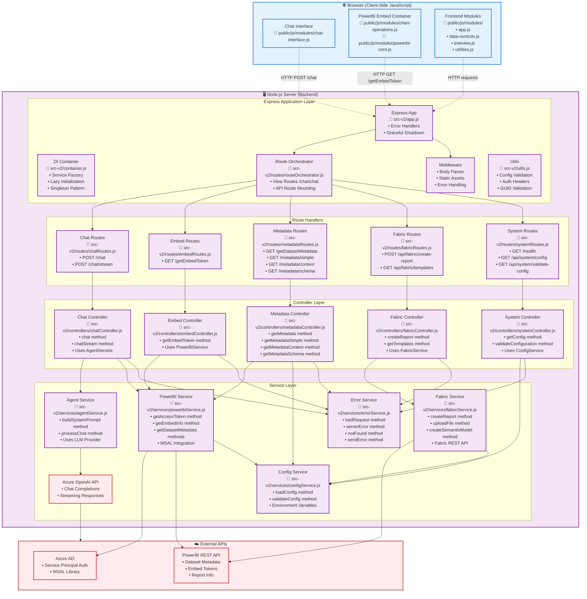
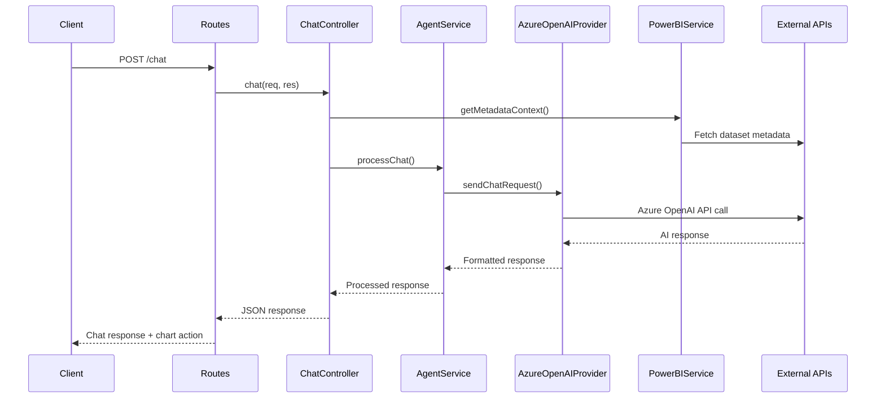
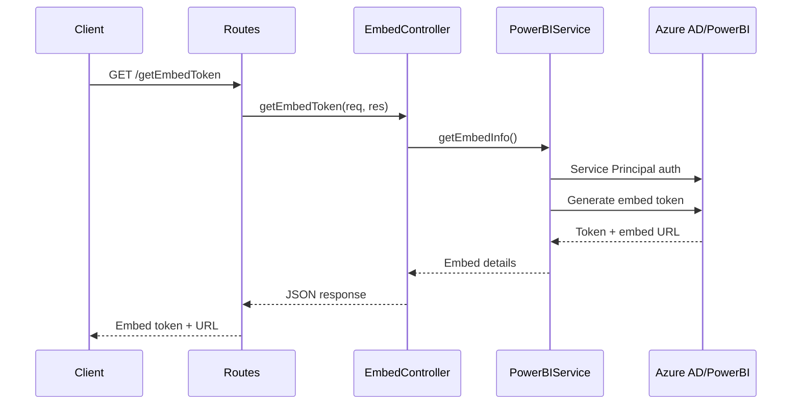
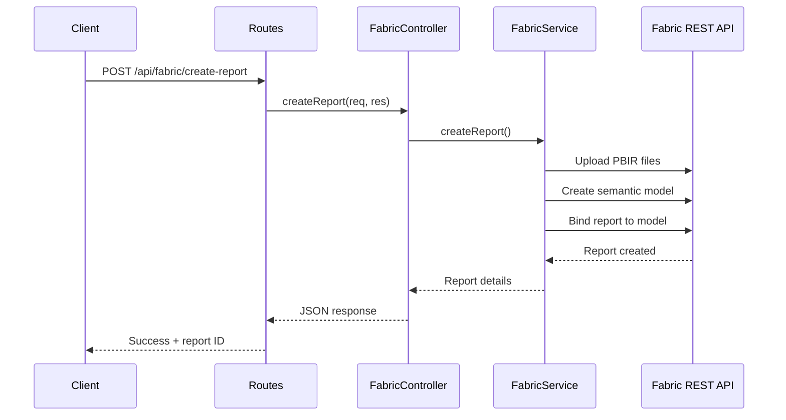

# Architecture Documentation

## Backend Architecture



## Request Flow Patterns

### Chat Request Flow


### Embed Token Flow


### Fabric Report Creation Flow


## Key Design Principles

### Dependency Injection Pattern
- **Container.js**: Central service factory with lazy initialization
- **Singleton Pattern**: Services are instantiated once and reused
- **Testability**: Services can be mocked/replaced via container
- **Loose Coupling**: Controllers depend on interfaces, not implementations

### Separation of Concerns
- **Controllers**: Handle HTTP requests/responses, orchestrate services
- **Services**: Contain business logic, external API integration
- **Providers**: Abstract external API communication (e.g., Azure OpenAI)
- **Utilities**: Shared functionality (config, validation, error handling)

### Error Handling Strategy
- Centralized error service for consistent error responses
- Standardized error formats across all endpoints
- Graceful degradation when external services fail

### Configuration Management
- Environment-based configuration via .env files
- Centralized validation on startup (fail-fast)
- Backwards compatibility for legacy environment variables

### Security Model
- Service Principal authentication for PowerBI and Fabric
- API key management through environment variables
- MSAL library for Azure AD token management
- No sensitive data in logs or responses

## File Structure Mapping

```
src-v2/
├── app.js                      # Express application setup, middleware, static assets
├── server.js                   # Server startup, error handlers, graceful shutdown
├── container.js                # Dependency injection container, service factory
├── utils.js                    # Validation utilities, auth helpers
├── routes/                     # Route definitions and mounting
│   ├── routeOrchestrator.js    → Route mounting, view handlers (/, /chartchat)
│   ├── chatRoutes.js           → Chat endpoints (/chat, /chat/stream)
│   ├── embedRoutes.js          → PowerBI embed endpoints (/getEmbedToken)
│   ├── metadataRoutes.js       → Dataset metadata endpoints (/getDatasetMetadata, etc.)
│   ├── fabricRoutes.js         → Fabric endpoints (/api/fabric/create-report)
│   └── systemRoutes.js         → System endpoints (/health, /api/system/config)
├── controllers/                # Request orchestration and business logic coordination
│   ├── chatController.js       → chat(), chatStream() - uses AgentService, PowerBIService
│   ├── embedController.js      → getEmbedToken() - uses PowerBIService
│   ├── metadataController.js   → getMetadata*() - uses PowerBIService, ConfigService
│   ├── fabricController.js     → createReport(), getTemplates() - uses FabricService
│   └── systemController.js     → getConfig(), validateConfiguration() - uses ConfigService
└── services/                   # Core business logic and external integrations
    ├── agentService.js         → AI agent logic, prompt building, chat orchestration
    ├── azureOpenAIProvider.js  → Azure OpenAI API client, streaming support
    ├── powerbiService.js       → PowerBI REST API, MSAL auth, metadata fetching
    ├── fabricService.js        → Fabric REST API, report creation, file upload
    ├── configService.js        → Environment configuration, validation
    └── errorService.js         → Standardized error responses
```

## Key Dependencies

### External Libraries
- **@azure/msal-node**: Service Principal authentication for PowerBI and Fabric
- **node-fetch**: HTTP requests to Azure OpenAI, PowerBI, and Fabric APIs
- **express**: Web framework and middleware
- **dotenv**: Environment variable management
- **guid**: GUID validation utilities

### Service Dependencies (via Dependency Injection)
- **Container** manages all service lifecycle and dependencies
- **Controllers** receive dependencies via constructor injection:
  - `chatController`: `agentService`, `powerbiService`
  - `embedController`: `powerbiService`
  - `metadataController`: `powerbiService`
  - `fabricController`: `fabricService`
  - `systemController`: uses `configService` directly
  
- **Services** receive dependencies via constructor injection:
  - `agentService`: `azureOpenAIProvider`
  - `azureOpenAIProvider`: config object, `fetch` (HTTP client)
  - `powerbiService`: config object, `msalClient`, `fetch` (HTTP client)
  - `fabricService`: config object, `fetch` (HTTP client)
  - `configService`: stateless, no dependencies

- **All services** use `errorService` for consistent error responses

### Architectural Flow
```
Container (DI)
  ↓
Controllers (HTTP handlers)
  ↓
Services (Business logic)
  ↓
Providers/Clients (External APIs)
  ↓
External Services (Azure OpenAI, PowerBI, Fabric)
```