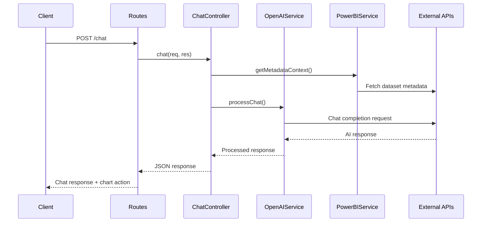
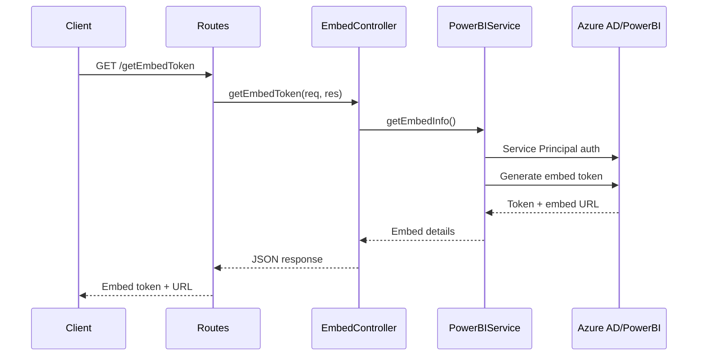

# Architecture Documentation

## Backend Architecture

```mermaid
graph TB
    subgraph Browser["🌐 Browser (Client-Side JavaScript)"]
        UI["Chat Interface<br/>📁 public/js/modules/chat-interface.js"]
        Chart["PowerBI Embed Container<br/>📁 public/js/modules/chart-operations.js<br/>📁 public/js/modules/powerbi-core.js"]
        ClientJS["Frontend Modules<br/>📁 public/js/modules/<br/>• app.js<br/>• data-controls.js<br/>• treeview.js"]
    end

    subgraph NodeServer["🖥️ Node.js Server (Backend)"]
        subgraph "Express Application Layer"
            App["Express App<br/>📁 src-v2/app.js<br/>• Error Handlers<br/>• Graceful Shutdown"]
            Routes["Route Index<br/>📁 src-v2/routes/index.js<br/>• View Routes /chartchat<br/>• API Route Mounting"]
            Middleware["Middleware<br/>• Body Parser<br/>• Telemetry Capture<br/>• Static Assets"]
            Utils["Utils<br/>📁 src-v2/utils.js<br/>• Config Validation<br/>• Auth Headers<br/>• GUID Validation"]
        end

        subgraph "Route Handlers"
            ChatRoutes["Chat Routes<br/>📁 src-v2/routes/chatRoutes.js<br/>• POST /chat<br/>• POST /chat/stream"]
            EmbedRoutes["Embed Routes<br/>📁 src-v2/routes/embedRoutes.js<br/>• GET /getEmbedToken"]
            MetaRoutes["Metadata Routes<br/>📁 src-v2/routes/metadataRoutes.js<br/>• GET /getDatasetMetadata<br/>• GET /metadata/health<br/>• GET /debug/metadata"]
            SysRoutes["System Routes<br/>📁 src-v2/routes/systemRoutes.js<br/>• GET /health<br/>• GET /status<br/>• GET /logs<br/>• POST /log-error"]
        end

        subgraph "Controller Layer"
            ChatCtrl["Chat Controller<br/>📁 src-v2/controllers/chatController.js<br/>• chat method<br/>• chatStream method<br/>• healthCheck method"]
            EmbedCtrl["Embed Controller<br/>📁 src-v2/controllers/embedController.js<br/>• getEmbedToken method<br/>• healthCheck method"]
            MetaCtrl["Metadata Controller<br/>📁 src-v2/controllers/metadataController.js<br/>• getDatasetMetadata method<br/>• getMetadataDebugInfo method<br/>• healthCheck method"]
            SysCtrl["System Controller<br/>📁 src-v2/controllers/systemController.js<br/>• healthCheck method<br/>• detailedHealthCheck method<br/>• getTelemetryLogs method"]
        end

        subgraph "Service Layer"
            OpenAI["OpenAI Service<br/>📁 src-v2/services/openaiService.js<br/>• processChat method<br/>• buildSystemPrompt method<br/>• Streaming Support<br/>• Telemetry Integration"]
            PowerBI["PowerBI Service<br/>📁 src-v2/services/powerbiService.js<br/>• getAccessToken method<br/>• getEmbedInfo method<br/>• getMetadataContext method<br/>• MSAL Integration"]
            Config["Config Service<br/>📁 src-v2/services/configService.js<br/>• loadConfig method<br/>• validateConfig method<br/>• Environment Variables"]
            Cache["Cache Service<br/>📁 src-v2/services/cacheService.js<br/>• getCachedMetadata method<br/>• setCachedMetadata method<br/>• Cache Invalidation"]
            Error["Error Service<br/>📁 src-v2/services/errorService.js<br/>• badRequest method<br/>• serverError method<br/>• notFound method<br/>• sendError method"]
            Telemetry["Telemetry Service<br/>📁 src-v2/services/telemetryService.js<br/>• logRequest method<br/>• sanitizeObject method<br/>• recordEvent method"]
        end
    end

    subgraph External["☁️ External APIs"]
        AzureAI["Azure OpenAI API<br/>• Chat Completions<br/>• Streaming Responses"]
        PowerBIAPI["PowerBI REST API<br/>• Dataset Metadata<br/>• Embed Tokens<br/>• Report Info"]
        AzureAD["Azure AD<br/>• Service Principal Auth<br/>• MSAL Library"]
    end

    %% Browser to Server Communication
    UI -.->|"HTTP POST /chat"| App
    Chart -.->|"HTTP GET /getEmbedToken"| App
    ClientJS -.->|"HTTP requests"| App

    %% Server Internal Flow
    App --> Routes
    App --> Middleware
    Routes --> ChatRoutes
    Routes --> EmbedRoutes
    Routes --> MetaRoutes
    Routes --> SysRoutes

    ChatRoutes --> ChatCtrl
    EmbedRoutes --> EmbedCtrl
    MetaRoutes --> MetaCtrl
    SysRoutes --> SysCtrl

    ChatCtrl --> OpenAI
    ChatCtrl --> PowerBI
    ChatCtrl --> Telemetry
    ChatCtrl --> Error
    ChatCtrl --> Config

    EmbedCtrl --> PowerBI
    EmbedCtrl --> Error
    EmbedCtrl --> Utils

    MetaCtrl --> PowerBI
    MetaCtrl --> Cache
    MetaCtrl --> Error
    MetaCtrl --> Config

    SysCtrl --> Config
    SysCtrl --> Telemetry

    %% Server to External APIs
    OpenAI --> AzureAI
    OpenAI --> Config
    OpenAI --> Telemetry

    PowerBI --> AzureAD
    PowerBI --> PowerBIAPI
    PowerBI --> Config
    PowerBI --> Cache
    PowerBI --> Error

    %% Styling
    classDef browser fill:#e3f2fd,stroke:#1976d2,stroke-width:2px
    classDef server fill:#f3e5f5,stroke:#7b1fa2,stroke-width:2px
    classDef external fill:#ffebee,stroke:#c62828,stroke-width:2px

    class Browser browser
    class NodeServer server
    class External external
    
    class UI,Chart,ClientJS browser
    class App,Routes,Middleware,Utils,ChatRoutes,EmbedRoutes,MetaRoutes,SysRoutes,ChatCtrl,EmbedCtrl,MetaCtrl,SysCtrl,OpenAI,PowerBI,Config,Cache,Error,Telemetry server
    class AzureAI,PowerBIAPI,AzureAD external
```



## Request Flow Patterns

### Chat Request Flow


### Embed Token Flow


## Key Design Principles

### Separation of Concerns
- **Controllers**: Handle HTTP requests/responses, orchestrate services
- **Services**: Contain business logic, external API integration
- **Utilities**: Shared functionality (config, cache, error handling)

### Error Handling Strategy
- Centralized error service for consistent error responses
- Telemetry integration for monitoring and debugging
- Graceful degradation when external services fail

### Caching Strategy
- Dataset metadata cached to reduce PowerBI API calls
- Cache invalidation on configuration changes
- Performance optimization for repeated requests

### Security Model
- Service Principal authentication for PowerBI
- API key management through environment variables
- No sensitive data in logs or telemetry

## File Structure Mapping

```
src-v2/
├── app.js                    # Express application setup, middleware, static assets
├── server.js                # Server startup, error handlers, graceful shutdown
├── utils.js                 # Validation utilities, auth helpers
├── routes/                  # Route definitions and mounting
│   ├── index.js             → Route mounting, view handlers (/, /chartchat)
│   ├── chatRoutes.js        → Chat endpoints (/chat, /chat/stream)
│   ├── embedRoutes.js       → PowerBI embed endpoints (/getEmbedToken)
│   ├── metadataRoutes.js    → Dataset metadata endpoints (/getDatasetMetadata)
│   └── systemRoutes.js      → System endpoints (/health, /status, /logs)
├── controllers/             # Request orchestration and business logic coordination
│   ├── chatController.js    → chat(), chatStream(), healthCheck()
│   ├── embedController.js   → getEmbedToken(), healthCheck()
│   ├── metadataController.js→ getDatasetMetadata(), getMetadataDebugInfo()
│   └── systemController.js  → healthCheck(), detailedHealthCheck(), getTelemetryLogs()
└── services/               # Core business logic and external integrations
    ├── openaiService.js     → Azure OpenAI integration, prompt building, streaming
    ├── powerbiService.js    → PowerBI REST API, MSAL auth, metadata fetching
    ├── configService.js     → Environment configuration, validation
    ├── cacheService.js      → In-memory caching, cache management
    ├── errorService.js      → Standardized error responses
    └── telemetryService.js  → Request logging, data sanitization, monitoring
```

## Key Dependencies

### External Libraries
- **@azure/msal-node**: Service Principal authentication for PowerBI
- **node-fetch**: HTTP requests to Azure OpenAI and PowerBI APIs
- **express**: Web framework and middleware
- **dotenv**: Environment variable management

### Service Dependencies
- All controllers depend on: `errorService`, `configService`
- `chatController`: `openaiService`, `powerbiService`, `telemetryService`
- `embedController`: `powerbiService`, `utils`
- `metadataController`: `powerbiService`, `cacheService`
- `systemController`: `telemetryService`
- `openaiService`: `configService`, `telemetryService`, Azure OpenAI API
- `powerbiService`: `configService`, `cacheService`, `errorService`, MSAL, PowerBI API