# Architecture Documentation

## Backend Architecture

```mermaid
graph TB
    subgraph Browser["🌐 Browser (Client-Side JavaScript)"]
        UI["Chat Interface<br/>📁 public/js/modules/chat-interface.js"]
        Chart["PowerBI Embed Container<br/>📁 public/js/modules/chart-operations.js<br/>📁 public/js/modules/powerbi-core.js"]
        ClientJS["Frontend Modules<br/>📁 public/js/modules/<br/>• app.js<br/>• data-controls.js<br/>• treeview.js<br/>• utilities.js"]
    end

    subgraph NodeServer["🖥️ Node.js Server (Backend)"]
        subgraph "Express Application Layer"
            App["Express App<br/>📁 src-v2/app.js<br/>• Error Handlers<br/>• Graceful Shutdown"]
            Container["DI Container<br/>📁 src-v2/container.js<br/>• Service Factory<br/>• Lazy Initialization<br/>• Singleton Pattern"]
            Routes["Route Orchestrator<br/>📁 src-v2/routes/routeOrchestrator.js<br/>• View Routes /chartchat<br/>• API Route Mounting"]
            Middleware["Middleware<br/>• Body Parser<br/>• Static Assets<br/>• Error Handling"]
            Utils["Utils<br/>📁 src-v2/utils.js<br/>• Config Validation<br/>• Auth Headers<br/>• GUID Validation"]
        end

        subgraph "Route Handlers"
            ChatRoutes["Chat Routes<br/>📁 src-v2/routes/chatRoutes.js<br/>• POST /chat<br/>• POST /chat/stream"]
            EmbedRoutes["Embed Routes<br/>📁 src-v2/routes/embedRoutes.js<br/>• GET /getEmbedToken"]
            MetaRoutes["Metadata Routes<br/>📁 src-v2/routes/metadataRoutes.js<br/>• GET /getDatasetMetadata<br/>• GET /metadata/simple<br/>• GET /metadata/context<br/>• GET /metadata/schema"]
            FabricRoutes["Fabric Routes<br/>📁 src-v2/routes/fabricRoutes.js<br/>• POST /api/fabric/create-report<br/>• GET /api/fabric/templates"]
            SysRoutes["System Routes<br/>📁 src-v2/routes/systemRoutes.js<br/>• GET /health<br/>• GET /api/system/config<br/>• GET /api/system/validate-config"]
        end

        subgraph "Controller Layer"
            ChatCtrl["Chat Controller<br/>📁 src-v2/controllers/chatController.js<br/>• chat method<br/>• chatStream method<br/>• Uses AgentService"]
            EmbedCtrl["Embed Controller<br/>📁 src-v2/controllers/embedController.js<br/>• getEmbedToken method<br/>• Uses PowerBIService"]
            MetaCtrl["Metadata Controller<br/>📁 src-v2/controllers/metadataController.js<br/>• getMetadata method<br/>• getMetadataSimple method<br/>• getMetadataContext method<br/>• getMetadataSchema method"]
            FabricCtrl["Fabric Controller<br/>📁 src-v2/controllers/fabricController.js<br/>• createReport method<br/>• getTemplates method<br/>• Uses FabricService"]
            SysCtrl["System Controller<br/>📁 src-v2/controllers/systemController.js<br/>• getConfig method<br/>• validateConfiguration method<br/>• Uses ConfigService"]
        end

        subgraph "Service Layer"
            Agent["Agent Service<br/>📁 src-v2/services/agentService.js<br/>• buildSystemPrompt method<br/>• processChat method<br/>• Uses LLM Provider"]
            AzureAI["Azure OpenAI Provider<br/>📁 src-v2/services/azureOpenAIProvider.js<br/>• sendChatRequest method<br/>• sendStreamingRequest method<br/>• HTTP Client Integration"]
            PowerBI["PowerBI Service<br/>📁 src-v2/services/powerbiService.js<br/>• getAccessToken method<br/>• getEmbedInfo method<br/>• getDatasetMetadata methods<br/>• MSAL Integration"]
            Fabric["Fabric Service<br/>📁 src-v2/services/fabricService.js<br/>• createReport method<br/>• uploadFile method<br/>• createSemanticModel method<br/>• Fabric REST API"]
            Config["Config Service<br/>📁 src-v2/services/configService.js<br/>• loadConfig method<br/>• validateConfig method<br/>• Environment Variables"]
            Error["Error Service<br/>📁 src-v2/services/errorService.js<br/>• badRequest method<br/>• serverError method<br/>• notFound method<br/>• sendError method"]
        end
    end

    subgraph External["☁️ External APIs"]
        AzureAI["Azure OpenAI API<br/>• Chat Completions<br/>• Streaming Responses"]
        PowerBIAPI["PowerBI REST API<br/>• Dataset Metadata<br/>• Embed Tokens<br/>• Report Info"]
        AzureAD["Azure AD<br/>• Service Principal Auth<br/>• MSAL Library"]
    end

    %% Browser to Server Communication
    UI -.->|"HTTP POST /chat"| App
    Chart -.->|"HTTP GET /getEmbedToken"| App
    ClientJS -.->|"HTTP requests"| App

    %% Server Internal Flow
    App --> Routes
    App --> Middleware
    Routes --> ChatRoutes
    Routes --> EmbedRoutes
    Routes --> MetaRoutes
    Routes --> FabricRoutes
    Routes --> SysRoutes

    ChatRoutes --> ChatCtrl
    EmbedRoutes --> EmbedCtrl
    MetaRoutes --> MetaCtrl
    FabricRoutes --> FabricCtrl
    SysRoutes --> SysCtrl

    %% Controller dependencies
    ChatCtrl --> Agent
    ChatCtrl --> PowerBI
    ChatCtrl --> Error

    EmbedCtrl --> PowerBI
    EmbedCtrl --> Error

    MetaCtrl --> PowerBI
    MetaCtrl --> Config
    MetaCtrl --> Error

    FabricCtrl --> Fabric
    FabricCtrl --> Error

    SysCtrl --> Config
    SysCtrl --> Error

    %% Service dependencies
    Agent --> AzureAI
    
    AzureAI --> External
    PowerBI --> AzureAD
    PowerBI --> PowerBIAPI
    PowerBI --> Config
    
    Fabric --> PowerBIAPI
    Fabric --> Config

    %% Styling
    classDef browser fill:#e3f2fd,stroke:#1976d2,stroke-width:2px
    classDef server fill:#f3e5f5,stroke:#7b1fa2,stroke-width:2px
    classDef external fill:#ffebee,stroke:#c62828,stroke-width:2px

    class Browser browser
    class NodeServer server
    class External external
    
    class UI,Chart,ClientJS browser
    class App,Container,Routes,Middleware,Utils,ChatRoutes,EmbedRoutes,MetaRoutes,FabricRoutes,SysRoutes,ChatCtrl,EmbedCtrl,MetaCtrl,FabricCtrl,SysCtrl,Agent,AzureAI,PowerBI,Fabric,Config,Error server
    class AzureAI,PowerBIAPI,AzureAD external
```



## Request Flow Patterns

### Chat Request Flow


### Embed Token Flow


### Fabric Report Creation Flow


## Key Design Principles

### Dependency Injection Pattern
- **Container.js**: Central service factory with lazy initialization
- **Singleton Pattern**: Services are instantiated once and reused
- **Testability**: Services can be mocked/replaced via container
- **Loose Coupling**: Controllers depend on interfaces, not implementations

### Separation of Concerns
- **Controllers**: Handle HTTP requests/responses, orchestrate services
- **Services**: Contain business logic, external API integration
- **Providers**: Abstract external API communication (e.g., Azure OpenAI)
- **Utilities**: Shared functionality (config, validation, error handling)

### Error Handling Strategy
- Centralized error service for consistent error responses
- Standardized error formats across all endpoints
- Graceful degradation when external services fail

### Configuration Management
- Environment-based configuration via .env files
- Centralized validation on startup (fail-fast)
- Backwards compatibility for legacy environment variables

### Security Model
- Service Principal authentication for PowerBI and Fabric
- API key management through environment variables
- MSAL library for Azure AD token management
- No sensitive data in logs or responses

## File Structure Mapping

```
src-v2/
├── app.js                      # Express application setup, middleware, static assets
├── server.js                   # Server startup, error handlers, graceful shutdown
├── container.js                # Dependency injection container, service factory
├── utils.js                    # Validation utilities, auth helpers
├── routes/                     # Route definitions and mounting
│   ├── routeOrchestrator.js    → Route mounting, view handlers (/, /chartchat)
│   ├── chatRoutes.js           → Chat endpoints (/chat, /chat/stream)
│   ├── embedRoutes.js          → PowerBI embed endpoints (/getEmbedToken)
│   ├── metadataRoutes.js       → Dataset metadata endpoints (/getDatasetMetadata, etc.)
│   ├── fabricRoutes.js         → Fabric endpoints (/api/fabric/create-report)
│   └── systemRoutes.js         → System endpoints (/health, /api/system/config)
├── controllers/                # Request orchestration and business logic coordination
│   ├── chatController.js       → chat(), chatStream() - uses AgentService, PowerBIService
│   ├── embedController.js      → getEmbedToken() - uses PowerBIService
│   ├── metadataController.js   → getMetadata*() - uses PowerBIService, ConfigService
│   ├── fabricController.js     → createReport(), getTemplates() - uses FabricService
│   └── systemController.js     → getConfig(), validateConfiguration() - uses ConfigService
└── services/                   # Core business logic and external integrations
    ├── agentService.js         → AI agent logic, prompt building, chat orchestration
    ├── azureOpenAIProvider.js  → Azure OpenAI API client, streaming support
    ├── powerbiService.js       → PowerBI REST API, MSAL auth, metadata fetching
    ├── fabricService.js        → Fabric REST API, report creation, file upload
    ├── configService.js        → Environment configuration, validation
    └── errorService.js         → Standardized error responses
```

## Key Dependencies

### External Libraries
- **@azure/msal-node**: Service Principal authentication for PowerBI and Fabric
- **node-fetch**: HTTP requests to Azure OpenAI, PowerBI, and Fabric APIs
- **express**: Web framework and middleware
- **dotenv**: Environment variable management
- **guid**: GUID validation utilities

### Service Dependencies (via Dependency Injection)
- **Container** manages all service lifecycle and dependencies
- **Controllers** receive dependencies via constructor injection:
  - `chatController`: `agentService`, `powerbiService`
  - `embedController`: `powerbiService`
  - `metadataController`: `powerbiService`
  - `fabricController`: `fabricService`
  - `systemController`: uses `configService` directly
  
- **Services** receive dependencies via constructor injection:
  - `agentService`: `azureOpenAIProvider`
  - `azureOpenAIProvider`: config object, `fetch` (HTTP client)
  - `powerbiService`: config object, `msalClient`, `fetch` (HTTP client)
  - `fabricService`: config object, `fetch` (HTTP client)
  - `configService`: stateless, no dependencies

- **All services** use `errorService` for consistent error responses

### Architectural Flow
```
Container (DI)
  ↓
Controllers (HTTP handlers)
  ↓
Services (Business logic)
  ↓
Providers/Clients (External APIs)
  ↓
External Services (Azure OpenAI, PowerBI, Fabric)
```