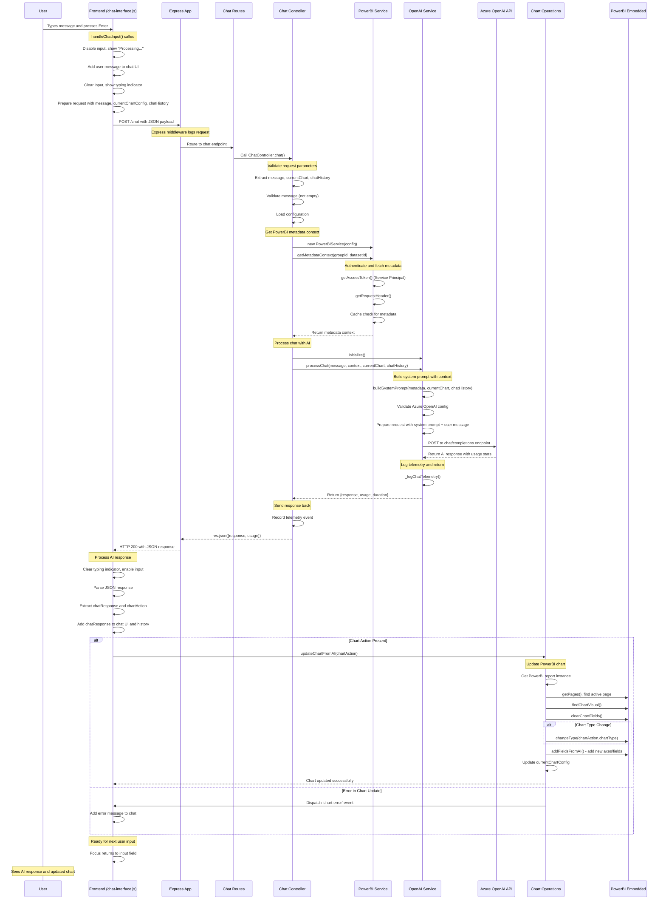

# Embed Copilot

Node.js application that embeds Power BI reports with an AI-powered chat interface for data visualization and chart creation.

## Features

- **Power BI Integration** - Secure report embedding with Service Principal authentication
- **AI Chat Interface** - Natural language chart creation using Azure OpenAI
- **Interactive UI** - Modern web interface with dataset schema explorer
- **Chart Operations** - Create and modify charts through conversation

## Quick Setup

1. **Install**
   ```bash
   git clone <repository-url>
   cd embed-copilot
   npm install
   ```

2. **Configure**
   ```bash
   cp .env.example .env
   # Edit .env with your Power BI and Azure OpenAI credentials
   ```

3. **Run**
   ```bash
   npm run dev
   ```

4. **Open** `http://localhost:5300`

## Required Environment Variables

**Power BI:**
- `POWERBI_TENANT_ID` - Azure AD tenant ID
- `POWERBI_CLIENT_ID` - App registration client ID  
- `POWERBI_CLIENT_SECRET` - App registration secret
- `POWERBI_WORKSPACE_ID` - Workspace containing your report
- `POWERBI_REPORT_ID` - Report to embed which should be a report with just an empty chart in it
- `POWERBI_DATASET_ID` - Dataset for metadata access

**Azure OpenAI:**
- `AZURE_OPENAI_ENDPOINT` - Service endpoint URL
- `AZURE_OPENAI_API_KEY` - API key
- `AZURE_OPENAI_DEPLOYMENT_NAME` - GPT model deployment name

## Usage

Ask the AI assistant questions like:
- "What data is available?"
- "Create a bar chart of sales by region" 
- "Show me top 5 performing products"
- "Change this to a line chart"

## Architecture

### Chat Message Flow

The following sequence diagram shows how a chat message flows through all software layers:



### Key Software Layers

1. **Frontend Layer** - User interface and chat management (`chat-interface.js`)
2. **Express Application** - HTTP routing and middleware (`app.js`, `routes/`)
3. **Controller Layer** - Request orchestration (`chatController.js`)
4. **Service Layer** - Business logic (PowerBI, OpenAI, Config services)
5. **External APIs** - Azure OpenAI and PowerBI REST APIs
6. **Chart Operations** - PowerBI visualization updates (`chart-operations.js`)
7. **PowerBI Embedded** - Report rendering and manipulation

The system maintains context through chat history, current chart configuration, and dataset metadata to provide intelligent, contextual responses.

## Development

```bash
npm run dev              # Development server
npm run dev:telemetry    # With telemetry logging
npm test                 # Run tests
npm run test:e2e         # End-to-end tests
```

## Model Performance Testing

Multiple Azure OpenAI models have been tested for optimal performance with this Power BI assistant. **GPT-4.1 Nano**, **GPT-4o Mini**, and **GPT-5 Chat** were evaluated for speed, reliability, and cost efficiency. All models passed comprehensive regression tests with 100% success rates.

📊 **[View Model Performance Report](./modelperformance.md)** - Detailed comparison results and recommendations

## Project Structure

```
src-v2/          # Backend (Express.js)
public/          # Frontend assets  
views/           # HTML templates
test/            # Test suite
tools/           # Development utilities
config/          # Configuration
```

## Health Checks

- `GET /health` - System health
- `GET /embed/health` - Power BI service
- `GET /chat/health` - OpenAI service

## License

MIT License - see `LICENSE` file.