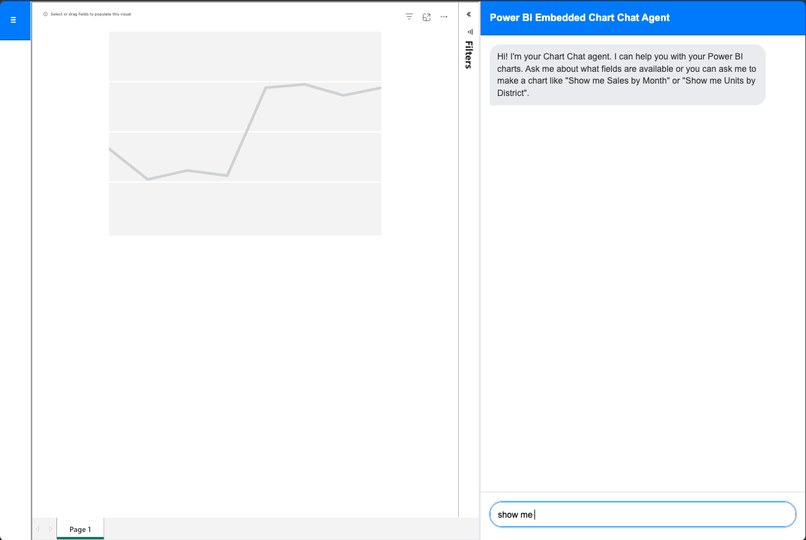
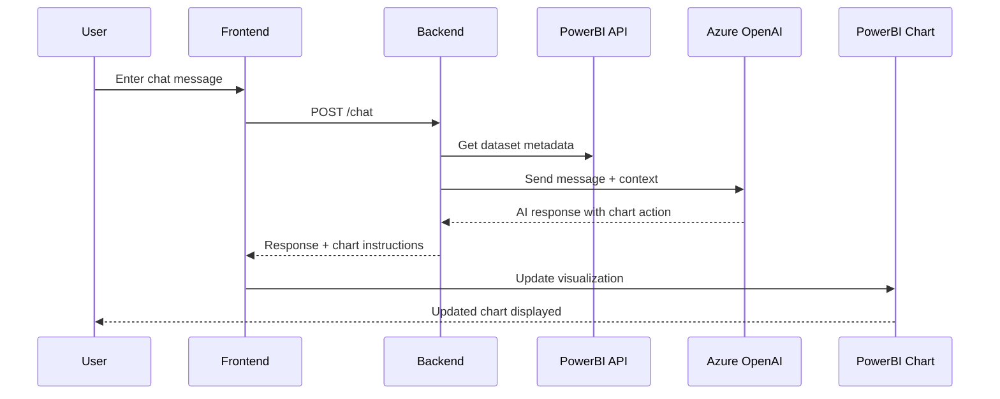

# Embed Copilot

Node.js application that embeds Power BI reports with an AI-powered chat interface for data visualization and chart creation.



## Features

- **Power BI Integration** - Secure report embedding with Service Principal authentication
- **AI Chat Interface** - Natural language chart creation using Azure OpenAI
- **Interactive UI** - Modern web interface with dataset schema explorer
- **Chart Operations** - Create and modify charts through conversation

## Quick Setup

1. **Install**
   ```bash
   git clone <repository-url>
   cd embed-copilot
   npm install
   ```

2. **Configure**
   ```bash
   cp .env.example .env
   # Edit .env with your Power BI and Azure OpenAI credentials
   ```

3. **Run**
   ```bash
   npm run dev
   ```

4. **Open** `http://localhost:5300`

## Required Environment Variables

**Power BI:**
- `TENANT_ID` - Azure AD tenant ID
- `CLIENT_ID` - App registration client ID  
- `CLIENT_SECRET` - App registration secret
- `POWERBI_WORKSPACE_ID` - Workspace containing your reports
- `POWERBI_DATASET_ID` - Dataset for metadata access

**Azure OpenAI:**
- `AZURE_OPENAI_ENDPOINT` - Service endpoint URL
- `AZURE_OPENAI_API_KEY` - API key
- `AZURE_OPENAI_DEPLOYMENT_NAME` - GPT model deployment name
- `AZURE_OPENAI_API_VERSION` - API version (default: 2023-12-01-preview)

## Usage

Ask the AI assistant questions like:
- "What data is available?"
- "Create a bar chart of sales by region" 
- "Show me top 5 performing products"
- "Change this to a line chart"

## Architecture

### Chat Message Flow



### Architecture Overview

- **Frontend**: Chat interface and PowerBI embed container
- **Backend**: Express.js API with chat controller and services  
- **PowerBI Integration**: Dataset metadata and chart manipulation
- **AI Integration**: Azure OpenAI for natural language processing

## Development

```bash
npm run dev              # Development server with nodemon
npm start                # Production server
npm run lint             # Run ESLint
npm run lint:fix         # Fix ESLint errors
```

## Model Performance Testing

Multiple Azure OpenAI models have been tested for optimal performance with this Power BI assistant. **GPT-4.1 Nano**, **GPT-4o Mini**, and **GPT-5 Chat** were evaluated for speed, reliability, and cost efficiency. All models passed comprehensive regression tests with 100% success rates.

📊 **[View Model Performance Report](./modelperformance.md)** - Detailed comparison results and recommendations

## Project Structure

```
src/                       # Backend (Express.js)
  ├── server.js            # Entry point
  ├── app.js               # Express app configuration
  ├── container.js         # Dependency injection container
  ├── utils.js             # Utility functions
  ├── routes/              # API route definitions
  ├── controllers/         # Request handlers
  └── services/            # Business logic (PowerBI, OpenAI, Fabric)
client/                    # Frontend (static files)
  ├── css/                 # Stylesheets
  ├── js/modules/          # Client-side JavaScript modules
  └── views/               # HTML pages
templates/report/          # Power BI report templates (PBIR format)
logs/                      # Runtime logs (not tracked in git)
```

## Health Checks

- `GET /health` - Basic system health check
- `GET /status` - Detailed system status with all services
- `GET /metadata/health` - Metadata service health

## License

MIT License - see `LICENSE` file.